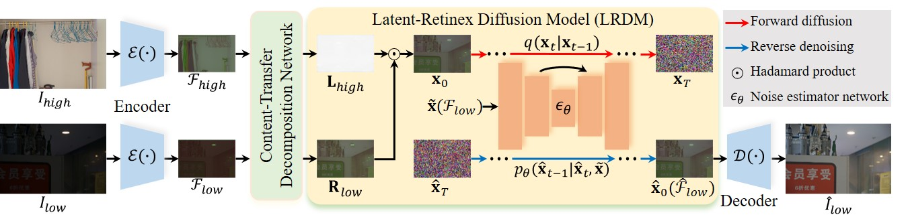

# [ECCV 2024] LightenDiffusion: Unsupervised Low-Light Image Enhancement with Latent-Retinex Diffusion Models [[Paper]](https://arxiv.org/pdf/2407.08939)
<h4 align="center">Hai Jiang<sup>1,5</sup>, Ao Luo<sup>2,5</sup>, Xiaohong Liu<sup>4</sup>, Songchen Han<sup>1</sup>, Shuaicheng Liu<sup>3,5</sup></center>
<h4 align="center">1.Sichuan University, 2.Southwest Jiaotong University, 
<h4 align="center">3.University of Electronic Science and Technology of China,</center></center>
<h4 align="center">4.Shanghai Jiaotong University, 5.Megvii Technology</center></center>

## Pipeline


## Dependencies
```
pip install -r requirements.txt
````

## Download the raw training and evaluation datasets
### Paired datasets 
LOL dataset: Chen Wei, Wenjing Wang, Wenhan Yang, and Jiaying Liu. "Deep Retinex Decomposition for Low-Light Enhancement". BMVC, 2018. [[Baiduyun (extracted code: sdd0)]](https://pan.baidu.com/s/1spt0kYU3OqsQSND-be4UaA) [[Google Drive]](https://drive.google.com/file/d/18bs_mAREhLipaM2qvhxs7u7ff2VSHet2/view?usp=sharing)

LSRW dataset: Jiang Hai, Zhu Xuan, Ren Yang, Yutong Hao, Fengzhu Zou, Fang Lin, and Songchen Han. "R2RNet: Low-light Image Enhancement via Real-low to Real-normal Network". Journal of Visual Communication and Image Representation, 2023. [[Baiduyun (extracted code: wmrr)]](https://pan.baidu.com/s/1XHWQAS0ZNrnCyZ-bq7MKvA)

### Unpaired datasets 
Please refer to [[Project Page of RetinexNet]](https://daooshee.github.io/BMVC2018website/).

## Pre-trained Models 
You can download our pre-trained model from [Hugging Face](...).

Alternatively, the model is also available on [[Google Drive]](https://drive.google.com/drive/folders/1m3t15rWw76IDDWJ0exLOe5P0uEnjk3zl?usp=drive_link) and [[Baidu Yun (extracted code:cjzk)]](https://pan.baidu.com/s/1fPLVgnZbdY1n75Flq54bMQ)

## How to train?
You need to modify ```datasets/dataset.py``` slightly for your environment, and then
```
python train.py  
```

## How to test?
```
python evaluate.py
```

## Visual comparison


## Citation
If you use this code or ideas from the paper for your research, please cite our paper:
```
@InProceedings{Jiang_2024_ECCV,
    author    = {Jiang, Hai and Luo, Ao and Liu, Xiaohong and Han, Songchen and Liu, Shuaicheng},
    title     = {LightenDiffusion: Unsupervised Low-Light Image Enhancement with Latent-Retinex Diffusion Models},
    booktitle = {European Conference on Computer Vision},
    year      = {2024},
    pages     = {}
}
```

## Acknowledgement
Part of the code is adapted from previous works: [WeatherDiff](https://github.com/IGITUGraz/WeatherDiffusion) and [MIMO-UNet](https://github.com/chosj95/MIMO-UNet). We thank all the authors for their contributions.

